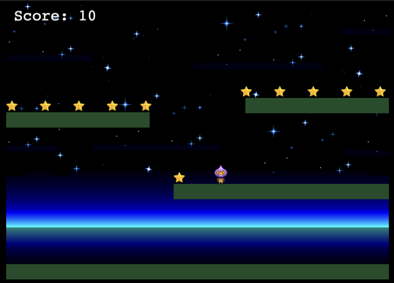

# Dude and Stars

**Dude and Stars** is an exciting and engaging game where players control a character, referred to as "Dude," who must navigate through various levels filled with obstacles and enemies to collect stars. The objective is to gather as many stars as possible while avoiding or overcoming challenges.

## How It Works

1. **Controls**: Players use keyboard or touch controls to move Dude left, right, jump, and perform other actions.
2. **Levels**: The game consists of multiple levels, each with increasing difficulty and unique design.
3. **Obstacles**: Players must avoid or overcome obstacles such as pits, spikes, and moving platforms.
4. **Enemies**: Various enemies will try to stop Dude from collecting stars. Players can defeat or avoid these enemies.
5. **Stars**: Collecting stars increases the player's score. Some stars may be hidden or require solving puzzles to obtain.
6. **Power-ups**: Throughout the game, players can find power-ups that grant special abilities or advantages.

The game combines elements of platforming, puzzle-solving, and action to provide a fun and challenging experience for players of all ages.

## How Copilot was used

Copilot was used extensively throughout the development of **Dude and Stars**. Here are some specific ways it contributed:

1. **Inline Suggestions**: Copilot provided inline suggestions to replace the logo with the game name "Dude and Stars".
2. **Chat Commands**: Using chat commands, Copilot helped to ensure the "GameOver" Scene was not played by adding `@workspace Do not play GameOver Scene`.
3. **Code Edits**: Copilot assisted in recreating the game and stars game from the tutorial, as well as fixing physics errors.
4. **Platform Addition**: It helped in adding platforms similar to those in the tutorial.
5. **Character Mechanics**: Copilot enabled Dude to walk and jump as demonstrated in the tutorial.
6. **Asset Integration**: The image for the bomb was sourced from phaser.io's shiny ball, as suggested by Copilot.

These contributions made the development process smoother and more efficient.